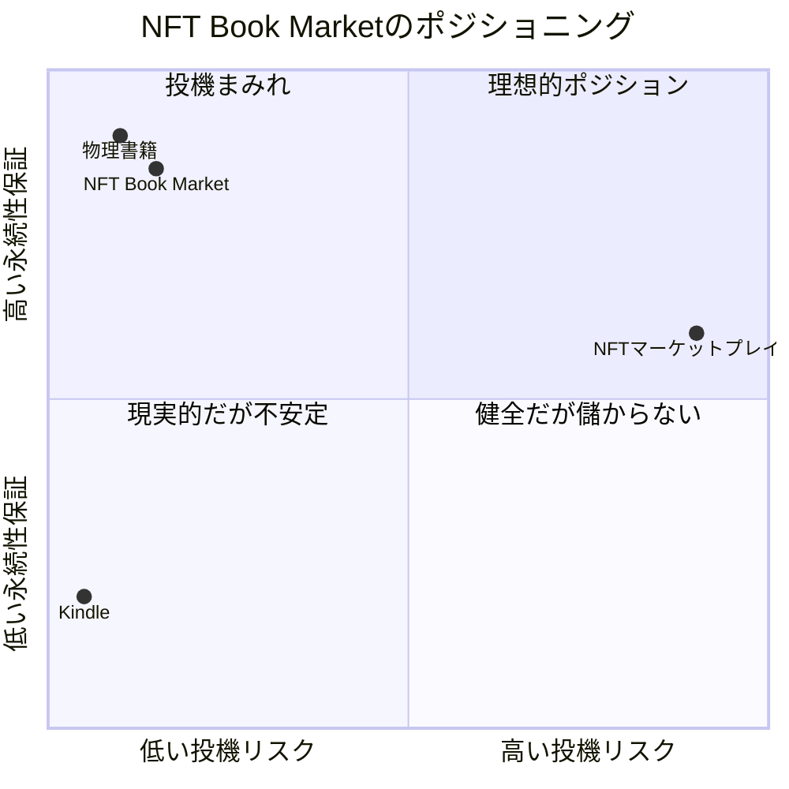

主要競合の強み・弱み分析、競合比較マトリクス、ポジショニングステートメント、3つのユニークセリングポイント（USP）を定義し、市場での独自の立ち位置を明確にします。

## 主要競合

| 競合  | 強み | 弱み | ターゲット |
| ----- | ---- | ---- | ---------- |
| **Amazon Kindle / KDP** | 圧倒的なユーザー数(数億人)、高い認知度、読み放題サービス | 手数料35%、著作権管理がAmazon中心、サービス終了リスク、購入者データ取得不可 | マスマーケット全般 |
| **楽天Kobo** | 日本市場での認知度、楽天ポイント連携 | Kindleと同様のプラットフォーム依存、所有権の制限 | 楽天経済圏ユーザー |
| **NFTマーケットプレイス(OpenSea等)** | NFT取引の自由度、既存のWeb3ユーザー基盤 | 投機目的の取引が主流、読書体験に最適化されていない、技術的敷居が高い | NFTコレクター・投機家 |
| **Mirror.xyz / Paragraph** | Web3ネイティブ、クリエイターファースト | ブログ・ニュースレター特化、書籍向けではない、UIが複雑 | Web3クリエイター・早期採用者 |
| **物理書籍(紙の本)** | 触覚体験、所有感、中古市場の確立 | 劣化・紛失リスク、持ち運び不便、在庫管理コスト | 伝統的な読書愛好家 |

## 競合比較マトリクス

| 機能・特徴   | NFT Book Market | Amazon Kindle | NFTマーケットプレイス | 物理書籍 |
| ------------ | ---- | ----- | ----- | ----- |
| **著者収益率** | ⭐⭐⭐⭐⭐ 85% | ⭐⭐⭐ 65% | ⭐⭐⭐⭐ 75-90% | ⭐⭐ 5-10% |
| **真の所有権** | ⭐⭐⭐⭐⭐ NFT保証 | ❌ ライセンスのみ | ⭐⭐⭐⭐⭐ NFT保証 | ⭐⭐⭐⭐⭐ 物理所有 |
| **サービス終了後の読書** | ⭐⭐⭐⭐⭐ Arweave+OSS | ❌ 全て消失 | ⭐⭐ 分散ストレージ次第 | ⭐⭐⭐⭐⭐ 影響なし |
| **投機抑制** | ⭐⭐⭐⭐⭐ 無限供給 | ⭐⭐⭐⭐⭐ 転売不可 | ❌ 投機まみれ | ⭐⭐⭐⭐ 新刊は転売困難 |
| **読書UX** | ⭐⭐⭐⭐ マルチデバイス | ⭐⭐⭐⭐⭐ 最高品質 | ⭐⭐ 読書特化なし | ⭐⭐⭐⭐ 触覚体験 |
| **譲渡の自由** | ⭐⭐⭐⭐⭐ 自由 | ❌ 不可 | ⭐⭐⭐⭐⭐ 自由 | ⭐⭐⭐⭐⭐ 自由 |
| **技術的敷居** | ⭐⭐⭐ Web3初心者は学習必要 | ⭐⭐⭐⭐⭐ 非常に簡単 | ⭐⭐ Web3知識必須 | ⭐⭐⭐⭐⭐ ゼロ |
| **永続性保証** | ⭐⭐⭐⭐⭐ 200年保証 | ❌ プラットフォーム依存 | ⭐⭐ 課金継続次第 | ⭐⭐⭐ 劣化あり |

## ポジショニングステートメント

> **NFT Book Market**は、**プラットフォーム依存リスクを懸念するインディーズ著者と、デジタル本の永続的所有を求める読者**のための**次世代デジタル出版プラットフォーム**で、
> **サービス終了後も読めなくなるリスクと投機的取引の弊害**を解決し、**真の所有権と健全な読書文化**を提供します。
>
> **Kindle等の従来型電子書籍プラットフォーム**とは異なり、**Arweave永久保存 + 無限供給モデル + オープンソースリーダー**を特徴としています。

---

## USP 1: サービス終了後も永続的に読める「真の所有権」

### 説明

NFT Book Marketで購入した本は、当社サービスが終了しても永続的に読み続けられます。

**3層アーキテクチャによる保証**:
1. **所有権レイヤー**: Ethereum上のNFT → プラットフォーム非依存で永続
2. **コンテンツレイヤー**: Arweaveに200年保証で保存
3. **リーダーレイヤー**: オープンソースのスタンドアロンリーダー → コミュニティが永続的にメンテナンス

### なぜ重要か

**Kindleの最大のリスク**:
- Amazonがサービスを終了したら、購入した全書籍が読めなくなる
- アカウント停止でも全て消失
- 所有権の記録自体がAmazonのデータベースに依存

**読者にとって**:
- 数十万円分の電子書籍コレクションが、一企業の都合で消失する恐怖から解放
- 子供や孫に譲渡・相続できる真のデジタル資産

**著者にとって**:
- プラットフォーム倒産後も作品が読まれ続ける
- 長期的な読者との関係構築に集中できる

### 競合との違い

| | NFT Book Market | Kindle | 物理書籍 |
|---|---|---|---|
| **サービス終了時** | 引き続き読書可能 | 全て消失 | 影響なし |
| **永続性保証** | Arweave 200年保証 | なし | 劣化・紛失リスク |
| **読書手段** | オープンソースリーダー | Kindleアプリ(Amazon専有) | 本そのもの |

**決定的な差別化**: Kindleと同等のUXを提供しながら、物理書籍並みの永続性を実現

---

## USP 2: 無限供給モデルによる投機の構造的排除

### 説明

全ての書籍NFTを**無限供給(Unlimited Supply)**で販売し、投機的取引を構造的に無効化します。

**投機が無効化されるロジック**:
1. 転売屋が¥1,200で購入 → 二次市場で¥2,000で出品
2. 買い手は「一次ミントで¥1,200で買えるのに、なぜ¥2,000払う?」
3. 二次市場での購入動機がゼロ → 転売屋は損失
4. 結果: 投機目的の購入が経済合理性を失う

**物理書籍との類似性**:
- 物理書籍も「絶版」以外は無限に印刷可能 → 新刊本の転売市場は存在しない
- NFT本も同じ構造を再現し、健全な読書文化を維持

### なぜ重要か

**NFT市場の弊害**:
- 希少性(限定発行)が投機的取引を誘発
- 本来の価値(書籍の場合は「読むこと」)が軽視される
- 著者の作品が「投資商品」として扱われ、ブランド毀損

**NFT Book Marketの哲学**:
- NFT技術を使いつつ、健全な読書文化を維持
- 「所有の自由」と「投機の防止」の両立

### 競合との違い

| | NFT Book Market | Kindle | NFTマーケットプレイス |
|---|---|---|---|
| **供給モデル** | 無限供給 | 事実上無限 | 限定発行が主流 |
| **投機リスク** | 構造的に不可能 | 転売不可 | 投機まみれ |
| **二次流通** | 定価ベースで譲渡可能 | 不可 | 価格高騰 |
| **健全性** | 読書文化重視 | 読書文化重視 | 投資目的主流 |

**決定的な差別化**: NFTの自由度を保ちながら、Kindle以上に健全な読書文化を実現

---

## USP 3: 著者ファーストの収益配分(85%)とコミュニティ直結

### 説明

売上の**85%を著者に直接還元**し、業界最高水準の収益性を実現。同時に、NFT保有者限定のコミュニティアクセスで著者と読者を直接つなぎます。

**収益配分**:
- 初回販売: 著者85% / プラットフォーム15%
- 二次流通: 著者10% / 譲渡者85% / プラットフォーム5%

**コミュニティ機能**:
- 全NFT保有者にDiscordコミュニティアクセス権
- 月1回の著者AMA(Ask Me Anything)イベント
- 次回作のプロット投票、未公開コンテンツアクセス

### なぜ重要か

**従来の出版モデルの課題**:
- 伝統的出版: 著者への印税5-10%、流通・販売プロセスが不透明
- Amazon KDP: 65%(手数料35%)、購入者データ取得不可
- 著者は収益性の低さと読者との距離に悩む

**NFT Book Marketの価値**:
- 中間マージンを最小化し、著者に直接還元
- 購入者データを著者が把握でき、長期的な関係構築が可能
- 読者は「ただ読むだけ」ではなく、「著者を応援している」実感を得られる

### 競合との違い

| | NFT Book Market | Amazon KDP | 伝統的出版 |
|---|---|---|---|
| **著者収益率** | 85% | 65% | 5-10% |
| **読者との関係** | 直接Discord接続 | なし | なし |
| **長期収益** | 二次流通ロイヤリティ10% | 1回限り | 1回限り |
| **データ所有** | 著者が全て把握 | Amazonが独占 | 出版社が独占 |

**決定的な差別化**: Kindle以上の収益性と、物理書籍以上の著者・読者の近さを同時実現

---

## ポジショニングマップ

**縦軸**: サービス終了後の読書継続性(永続性保証)
**横軸**: 投機的取引のリスク(左: 低い、右: 高い)

**NFT Book Marketの立ち位置**:
- 物理書籍並みの永続性(Arweave 200年保証)
- Kindle以上の投機抑制(無限供給モデル)
- NFTの自由度(譲渡・相続可能)を維持

---

## ターゲット市場のセグメント

### プライマリターゲット(Phase 1-2: 1-2年目)

**1. インディーズ著者**
- **サイズ**: 日本国内で推定5万人(セルフパブリッシング作家)
- **ペインポイント**: KDP手数料、読者との距離、プラットフォーム依存リスク
- **獲得戦略**: Web3イベント登壇、著者コミュニティでのケーススタディ共有

**2. Web3ネイティブ読者**
- **サイズ**: 日本国内で推定20万人(NFT保有者)
- **ペインポイント**: NFTの実用性不足、Kindleの所有感の欠如
- **獲得戦略**: NFTコミュニティでの認知拡大、実用的NFTとしてのポジショニング

### セカンダリターゲット(Phase 3: 3年目以降)

**3. 伝統的読書愛好家**
- **サイズ**: 日本国内で推定500万人(年間10冊以上購入)
- **ペインポイント**: Kindleのサービス終了リスク、物理書籍の場所問題
- **獲得戦略**: 「200年保証」「真の所有」を訴求、マスメディア露出

**4. 中堅・大手出版社**
- **サイズ**: 日本国内で推定200社
- **ペインポイント**: デジタル化の遅れ、Amazonへの依存度増加
- **獲得戦略**: B2Bパートナーシップ、ホワイトレーベル提供

---

## 競合優位性の持続性

### 技術的参入障壁

1. **Arweave統合の専門知識**: 200年保存保証の実装には高度な技術が必要
2. **オープンソースリーダーの開発**: スタンドアロン動作するリーダーの品質維持
3. **無限供給スマートコントラクト**: ガス最適化された ERC-721 実装

### ネットワーク効果

1. **著者コミュニティ**: 著者が増えるほど、読者が集まる
2. **読者コミュニティ**: 読者が増えるほど、著者が参加したくなる
3. **オープンソースコミュニティ**: リーダーアプリの継続的改善

### ブランド価値

1. **「健全な読書文化」のポジショニング**: 投機を排除する姿勢がブランド価値に
2. **「真の所有権」の保証**: Arweave保存の実績が信頼性を高める
3. **「著者ファースト」の哲学**: 85%還元が業界標準になる可能性

---

## リスクと対策

### リスク1: Web3技術への技術的敷居

- **リスク**: ウォレット接続、ガス代など、一般ユーザーには複雑
- **対策**:
  - メールアドレスでのアカウント作成 → 裏側でウォレット自動生成
  - ガス代の抽象化(クレジットカード決済時にプラットフォームが代行)
  - オンボーディングチュートリアルの充実

### リスク2: Kindleとの圧倒的な認知度差

- **リスク**: Amazonの数億人ユーザーに対し、ニッチ市場からスタート
- **対策**:
  - ニッチ(インディーズ著者・Web3読者)で強固なコミュニティを形成
  - 「Kindleにはできないこと」(永続性保証・投機抑制)を徹底訴求
  - PR戦略: 「Amazonがサービス終了したら?」という問題提起

### リスク3: 無限供給モデルの認知不足

- **リスク**: NFT=希少性という既存認識との乖離
- **対策**:
  - 「物理書籍と同じモデル」という説明で親しみやすく
  - ケーススタディで健全性を証明
  - メディア露出で「投機を排除するNFT」としての認知拡大
