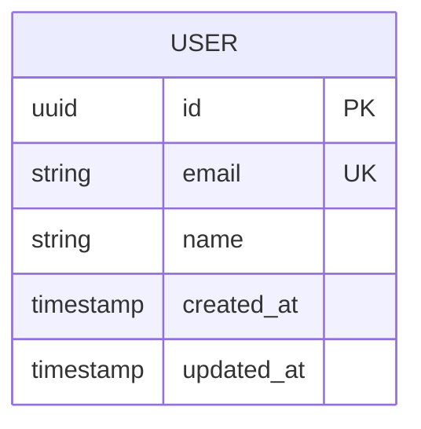

:::danger[このドキュメントについて]
このドキュメントはデータベーススキーマを定義するためのテンプレートです。
テーブル構造、リレーション、インデックス戦略を明確にしてください。
:::

ER図、テーブル定義(カラム、型、制約、インデックス)、マイグレーション戦略、ゼロダウンタイムマイグレーション、データ整合性(外部キー、チェック制約)、パフォーマンス最適化、バックアップ・リカバリ、セキュリティを定義します。

## ER図



---

## テーブル定義

### users

**説明**: ユーザー情報

| カラム名 | 型 | NULL | デフォルト | 制約 | 説明 |
|---------|-----|------|-----------|------|------|
| id | UUID | NO | gen_random_uuid() | PK | ユーザーID |
| email | VARCHAR(255) | NO | - | UNIQUE | メールアドレス |
| name | VARCHAR(100) | NO | - | - | ユーザー名 |
| created_at | TIMESTAMP | NO | CURRENT_TIMESTAMP | - | 作成日時 |
| updated_at | TIMESTAMP | NO | CURRENT_TIMESTAMP | - | 更新日時 |

**インデックス**:
- PRIMARY KEY: `id`
- UNIQUE INDEX: `email`
- INDEX: `created_at`

**備考**:
-

---

## マイグレーション戦略

### 命名規則

```
YYYYMMDDHHMMSS_description.sql
```

例: `20240115120000_create_users_table.sql`

### ダウンマイグレーション

すべてのマイグレーションに対応するロールバック用SQLを用意する。

### 本番環境へのマイグレーション手順

1. ステージング環境でマイグレーション実行
2. データ整合性チェック
3. パフォーマンステスト
4. 本番環境でメンテナンスウィンドウ確保
5. バックアップ取得
6. マイグレーション実行
7. 動作確認
8. 問題があればロールバック

### ゼロダウンタイムマイグレーション

以下のパターンを採用:

**カラム追加**:
1. 新カラム追加（NULL許可）
2. アプリケーションデプロイ（新カラムに書き込み開始）
3. 既存データを新カラムにバックフィル
4. NOT NULL制約追加

**カラム削除**:
1. アプリケーションデプロイ（カラム使用停止）
2. 数日待機（ロールバック可能性のため）
3. カラム削除

---

## データ整合性

### 外部キー制約

すべてのリレーションに外部キー制約を設定し、参照整合性を保証。

### ON DELETE 戦略

| テーブル | 外部キー | ON DELETE | 理由 |
|---------|---------|-----------|------|
|  |  |  |  |

### チェック制約

```sql
-- 例: emailのフォーマット検証
ALTER TABLE users ADD CONSTRAINT email_format
  CHECK (email ~* '^[A-Za-z0-9._%+-]+@[A-Za-z0-9.-]+\.[A-Z|a-z]{2,}$');
```

---

## パフォーマンス最適化

### インデックス戦略

**作成基準**:
- WHERE句で頻繁に使用されるカラム
- JOIN条件に使用されるカラム
- ORDER BY句で使用されるカラム

**避けるべきインデックス**:
- カーディナリティが低いカラム（性別など）
- 頻繁に更新されるカラム

### パーティショニング

大規模テーブル（1000万行以上）はパーティショニングを検討。

---

## バックアップ・リカバリ

### バックアップ戦略

| 種類 | 頻度 | 保持期間 |
|------|------|---------|
| フルバックアップ | 日次 | 30日 |
| 差分バックアップ | 6時間毎 | 7日 |
| トランザクションログ | 継続的 | 7日 |

### リカバリ手順

1. 最新のフルバックアップをリストア
2. 差分バックアップを適用
3. トランザクションログを指定時点まで適用
4. データ整合性チェック

---

## セキュリティ

### アクセス制御

| ロール | 権限 |
|--------|------|
| app_user | SELECT, INSERT, UPDATE, DELETE |
| app_readonly | SELECT |
| admin | ALL |

### 暗号化

- **転送時暗号化**: TLS 1.3
- **保存時暗号化**: AES-256
- **機密データ**: PII（個人識別情報）は追加のアプリケーションレベル暗号化
