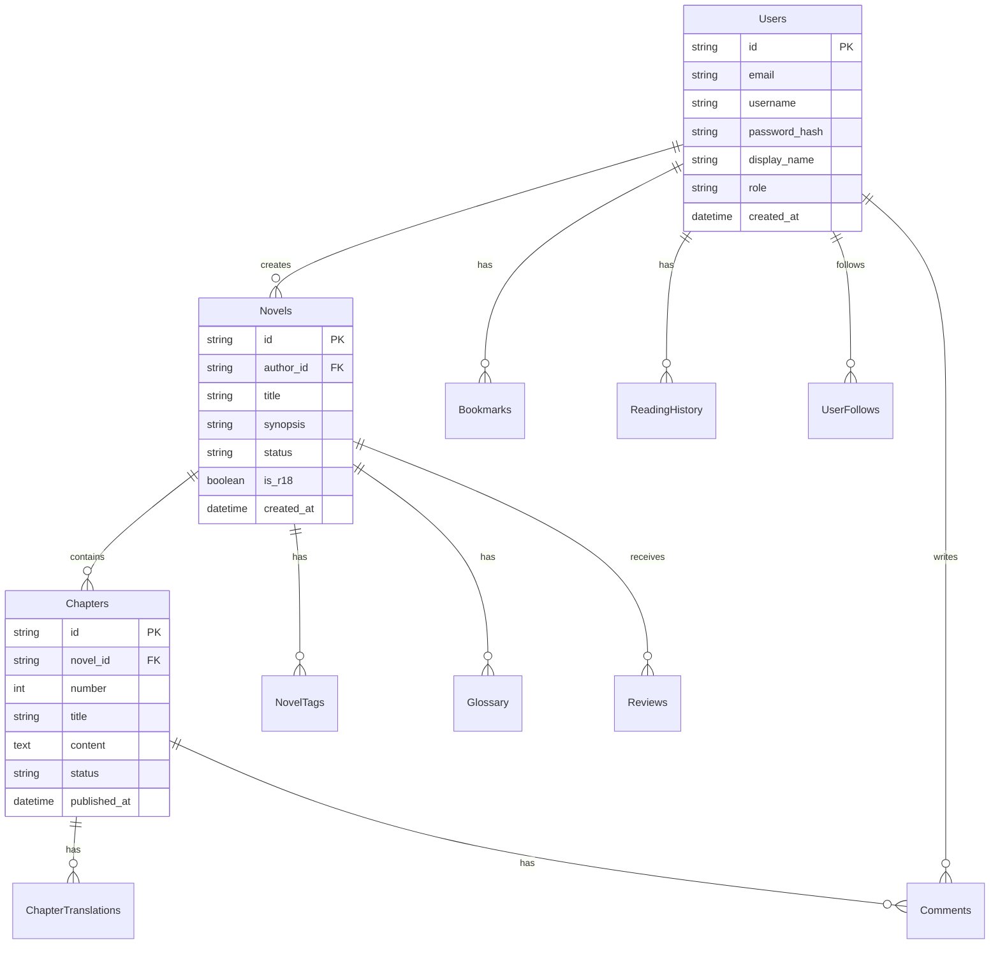

データベーススキーマ、ER図、マイグレーション戦略を定義します。

## データベース構成

- **Database**: Cloudflare D1 (SQLite) - 各自の環境
- **KeyValue Store**: Cloudflare KV - セッション、キャッシュ
- **Object Storage**: Cloudflare R2 - 画像、静的アセット

## ER図 (Mermaid)



## テーブル定義

### Users (ユーザー)

| カラム名 | 型 | 制約 | 説明 |
|----------|----|------|------|
| id | TEXT | PK | ユーザーID (usr_*) |
| email | TEXT | UNIQUE, NOT NULL | メールアドレス |
| username | TEXT | UNIQUE, NOT NULL | ユーザーID（表示用） |
| password_hash | TEXT | NOT NULL | パスワードハッシュ |
| display_name | TEXT | NOT NULL | 表示名 |
| bio | TEXT | | 自己紹介 |
| avatar_url | TEXT | | アバター画像URL |
| role | TEXT | DEFAULT 'user' | user, writer, admin |
| created_at | INTEGER | NOT NULL | 作成日時 (Unix Timestamp) |
| updated_at | INTEGER | NOT NULL | 更新日時 |

### Novels (小説)

| カラム名 | 型 | 制約 | 説明 |
|----------|----|------|------|
| id | TEXT | PK | 小説ID (nvl_*) |
| author_id | TEXT | FK, NOT NULL | 作者ID |
| title | TEXT | NOT NULL | タイトル |
| synopsis | TEXT | | あらすじ |
| genre | TEXT | | ジャンル |
| status | TEXT | DEFAULT 'draft' | draft, ongoing, completed, hiatus |
| is_r18 | INTEGER | DEFAULT 0 | R18フラグ |
| original_language | TEXT | DEFAULT 'ja' | 原語 |
| cover_url | TEXT | | 表紙画像URL |
| created_at | INTEGER | NOT NULL | 作成日時 |
| updated_at | INTEGER | NOT NULL | 更新日時 |

### Chapters (章)

| カラム名 | 型 | 制約 | 説明 |
|----------|----|------|------|
| id | TEXT | PK | 章ID (chp_*) |
| novel_id | TEXT | FK, NOT NULL | 小説ID |
| number | INTEGER | NOT NULL | 章番号 |
| title | TEXT | NOT NULL | 章タイトル |
| content | TEXT | NOT NULL | 本文（HTML/Markdown） |
| author_note | TEXT | | 作者コメント |
| status | TEXT | DEFAULT 'draft' | draft, published, scheduled |
| published_at | INTEGER | | 公開日時 |
| created_at | INTEGER | NOT NULL | 作成日時 |
| updated_at | INTEGER | NOT NULL | 更新日時 |

### ChapterTranslations (章翻訳)

| カラム名 | 型 | 制約 | 説明 |
|----------|----|------|------|
| id | TEXT | PK | 翻訳ID (tr_*) |
| chapter_id | TEXT | FK, NOT NULL | 原文の章ID |
| language | TEXT | NOT NULL | 言語コード (en, ko, zh-tw) |
| title | TEXT | NOT NULL | 翻訳タイトル |
| content | TEXT | NOT NULL | 翻訳本文 |
| is_auto_generated | INTEGER | DEFAULT 1 | 自動翻訳フラグ |
| created_at | INTEGER | NOT NULL | 作成日時 |

### Glossary (用語集)

| カラム名 | 型 | 制約 | 説明 |
|----------|----|------|------|
| id | TEXT | PK | 用語ID (gl_*) |
| novel_id | TEXT | FK, NOT NULL | 小説ID |
| term | TEXT | NOT NULL | 原語（例：エクスカリバー） |
| reading | TEXT | | 読み（フリガナ） |
| translation | TEXT | NOT NULL | 翻訳語（例：Excalibur） |
| target_language | TEXT | DEFAULT 'en' | 対象言語 |
| description | TEXT | | 説明、メモ |

### Bookmarks (ブックマーク)

| カラム名 | 型 | 制約 | 説明 |
|----------|----|------|------|
| id | TEXT | PK | ID |
| user_id | TEXT | FK, NOT NULL | ユーザーID |
| novel_id | TEXT | FK, NOT NULL | 小説ID |
| created_at | INTEGER | NOT NULL | 作成日時 |

### ReadingHistory (読書履歴・進捗)

| カラム名 | 型 | 制約 | 説明 |
|----------|----|------|------|
| user_id | TEXT | PK, FK | ユーザーID |
| chapter_id | TEXT | PK, FK | 章ID |
| progress | REAL | DEFAULT 0 | 進捗率 (0.0-1.0) |
| last_read_at | INTEGER | NOT NULL | 最終閲覧日時 |

## インデックス設計

```sql
CREATE INDEX idx_novels_author ON Novels(author_id);
CREATE INDEX idx_novels_updated ON Novels(updated_at DESC);
CREATE INDEX idx_chapters_novel ON Chapters(novel_id, number);
CREATE INDEX idx_glossary_novel ON Glossary(novel_id);
CREATE INDEX idx_history_user ON ReadingHistory(user_id, last_read_at DESC);
```
