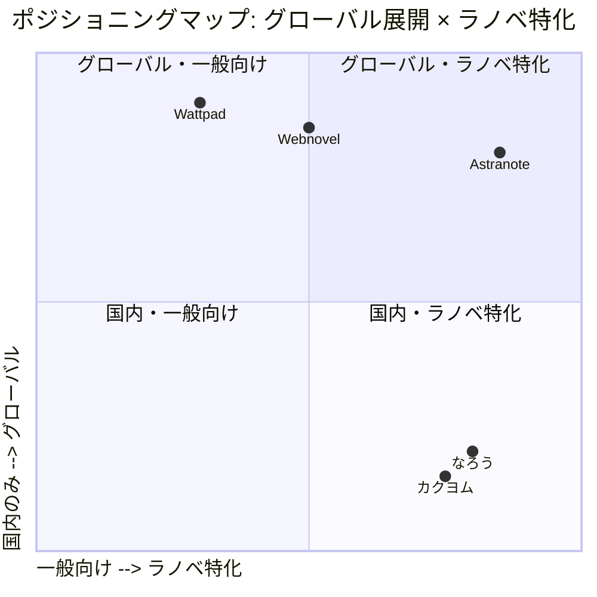

# ポジショニング戦略

> **テンプレート利用ガイド**
> プロダクトの市場でのポジショニング（立ち位置）を定義するドキュメントです。
> 競合との差別化、ターゲット市場の明確化、独自の価値提案を定義します。
> **利用職種**: PdM (主), PMM, 経営層

---

## 1. エグゼクティブサマリー

Astranoteは、グローバルWeb小説・ライトノベル市場($2.1B SAM)において、**「グローバル × ラノベ特化 × AI翻訳」という競合不在の独自ポジション**を確立する。既存プラットフォームが一般向けコンテンツまたは国内市場のみに注力する中、Astranoteは日本のライトノベル文化をグローバルに展開する価値提案で差別化を図る。AI翻訳技術により言語の壁を取り除き、作家は世界中の読者にリーチし、読者は母国語で日本のラノベ文化を楽しめる。

---

## 2. 市場定義 (Market Definition)

### ターゲット市場
- **TAM (Total Addressable Market)**: $15.2B
  - グローバル電子書籍・Web小説市場（2024年）
  - CAGR 6.5%で成長中
- **SAM (Serviceable Available Market)**: $2.1B
  - ライトノベル・アジア発Web小説市場
  - 日本ライトノベル($450M) + 日本Web小説($180M) + 海外翻訳市場($320M) + 韓国Web小説($580M) + 中国→海外Web小説($520M)
- **SOM (Serviceable Obtainable Market)**: $21M (Year 5目標)
  - SAMの1%を5年間で獲得
  - 25,000作家、MAU 700,000読者

### 市場セグメント
| セグメント | 市場規模 | 成長率 | 当社の優先度 |
| --- | --- | --- | --- |
| 日本Web小説市場 | $180M | 8% | **High** |
| 海外ラノベ翻訳市場 | $320M | 12% | **High** |
| 韓国Web小説市場 | $580M | 14% | Medium |
| 中国→海外Web小説 | $520M | 15% | Low (将来的) |

### 市場トレンド
1. **AI翻訳技術の進化**: GPT-4レベルの自然な翻訳が実現、2025年以降は文脈・文体対応が進む
2. **日本コンテンツのグローバル人気**: アニメ市場(海外)は$18B規模、CAGR 10.7%で成長
3. **クリエイターエコノミーの拡大**: グローバルクリエイター人口が2020年50M→2024年200Mに増加
4. **Web小説市場の急成長**: グローバルWeb小説プラットフォーム市場はCAGR 14.0%

参照: [21.03_Market_Trends.md](../20_Discovery_Research/21.03_Market_Trends.md)

---

## 3. ターゲット顧客 (Target Customer)

### プライマリターゲット: Web小説作家

- **Persona**: 日本のアクティブWeb小説作家
- **規模**: 約10万人（なろう + カクヨム投稿者）
- **特徴**:
  - 「小説家になろう」「カクヨム」等で作品を公開
  - 海外読者へのリーチを望むが翻訳の壁がある
  - 書籍化・アニメ化を目指している
- **ペインポイント**:
  - 公式翻訳は限られた作品のみ
  - ファン翻訳は品質が不安定
  - 海外での収益化が困難
- **予算感**: 無料〜月額$10（Pro機能）

### セカンダリターゲット1: 海外のラノベファン

- **Persona**: 英語圏・アジアの日本コンテンツファン
- **規模**: 推定500万人（既存）+ 2,000万人（潜在層）
- **特徴**:
  - アニメ・マンガから入り、原作ラノベに興味
  - Reddit、翻訳サイトで情報収集
  - 母国語で最新作を読みたい
- **ペインポイント**:
  - 公式翻訳は遅い・限定的
  - 翻訳サイトは広告が多く品質が不安定
  - 作家を直接支援する手段がない
- **予算感**: 無料〜月額$5-10（サブスク）

### セカンダリターゲット2: 海外のラノベ風作家

- **Persona**: Wattpad、Royal Road等で活動する作家
- **規模**: 推定5万人
- **特徴**:
  - 日本のラノベスタイルで執筆
  - グローバル読者を既に持つ
  - 多言語展開に興味がある
- **予算感**: 月額$10-20（Pro機能）

---

## 4. 競合分析 (Competitive Landscape)

### 主要競合
| 競合名 | ポジショニング | 強み | 弱み | 価格帯 |
| --- | --- | --- | --- | --- |
| **Wattpad** | グローバル・一般小説 | 巨大ユーザーベース(90M MAU)、多言語対応 | ラノベ特化でない、翻訳品質低い | 無料〜$5.99/月 |
| **Webnovel** | 中国Web小説のグローバル展開 | 豊富なコンテンツ、収益化システム | ラノベ文化の理解不足、UI/UX劣る | 無料〜課金制 |
| **小説家になろう** | 日本国内Web小説プラットフォーム | 圧倒的な作品数(100万+)、コミュニティ | 国内のみ、翻訳機能なし、収益化弱い | 完全無料 |
| **カクヨム** | 日本国内Web小説プラットフォーム | KADOKAWA連携、出版への道 | 国内のみ、翻訳機能なし | 無料〜ロイヤリティ |

### ポジショニングマップ


### 競合の財務指標（推定）
| プラットフォーム | MAU | ARR | ARPU |
|-----------------|-----|-----|------|
| Wattpad | 90M | $500M | $5.6 |
| Webnovel | 50M | $300M | $6.0 |
| 小説家になろう | 15M | $30M | $2.0 |
| カクヨム | 3M | $10M | $3.3 |
| **Astranote (Year 5目標)** | **0.7M** | **$21M** | **$30** |

**Astranoteの高ARPU戦略:**
- グローバル読者（北米・欧州の購買力）
- プレミアム機能（AI翻訳、用語集、高度な分析）
- 作家サブスクという独自収益源

参照: [63.01_Battlecard_<Competitor_Name>.md](../60_Marketing_GTM/63.01_Battlecard_<Competitor_Name>.md)

---

## 5. 当社のポジショニング (Our Positioning)

### ポジショニングステートメント
```
日本のWeb小説作家および海外の日本文化ファンにとって、
Web小説プラットフォーム市場において、
Astranoteは、
AI翻訳によるグローバル展開を実現するライトノベル特化プラットフォームである。
なぜなら、既存プラットフォームは国内のみまたは一般向けコンテンツに注力し、
日本のライトノベル文化をグローバルに展開する最適なソリューションが存在しないからである。
```

### 独自の価値提案 (Unique Value Proposition)

#### 作家向け
1. **ワンクリックグローバル展開**: 日本語で書いた作品を、ボタン1つで世界中の読者に届けられる
2. **ラノベ特化AI翻訳**: 固有名詞、キャラ設定、世界観を保持した高品質翻訳
3. **グローバル収益化**: 海外読者からの投げ銭・サブスクで直接収益を得られる

#### 読者向け
1. **母国語で最新作を読める**: 公式翻訳を待たず、AIによる高品質翻訳で最新話を楽しめる
2. **作家を直接支援**: 投げ銭・サブスクで好きな作家を支援し、創作を応援できる
3. **ラノベ文化のハブ**: 日本のライトノベル文化を深く理解したコミュニティ

参照: [61.01_Messaging_House.md](../60_Marketing_GTM/61.01_Messaging_House.md)

---

## 6. 差別化要因 (Differentiation)

### 3つの差別化ポイント

#### 1. ラノベ特化AI翻訳エンジン
- **説明**:
  - ライトノベル固有の表現（異世界用語、キャラ設定、魔法体系等）を理解するAI翻訳
  - 作家が作成した用語集・キャラ設定を翻訳に反映
  - 文体（一人称・三人称、口調等）を保持
- **競合との違い**:
  - Wattpad/Webnovelは汎用翻訳で固有名詞が崩れる
  - なろう/カクヨムは翻訳機能がない
- **顧客価値**:
  - 作家: 世界観を損なわずにグローバル展開できる
  - 読者: 原作の雰囲気を保った自然な翻訳で楽しめる

#### 2. グローバル × ラノベ特化という競合不在ポジション
- **説明**:
  - グローバル展開とライトノベル特化を同時実現
  - 日本のWeb小説文化とグローバル読者をつなぐハブ
  - 先行者優位（3-5年のリード）を確保
- **競合との違い**:
  - Wattpad/Webnovel: グローバルだが一般向け、ラノベ文化の理解が浅い
  - なろう/カクヨム: ラノベ特化だが国内のみ
- **顧客価値**:
  - 作家: 競合のいない市場で早期に読者基盤を構築できる
  - 読者: ラノベ文化に最適化されたプラットフォームで楽しめる

#### 3. 作家ファーストのエコシステム
- **説明**:
  - 作家が読者と直接つながり、収益化できる仕組み
  - 投げ銭、サブスク、Pro機能でマネタイズを支援
  - 作家向け分析ツール（どの国で人気か、翻訳品質等）
- **競合との違い**:
  - なろう/カクヨム: 広告収益のみ、作家への還元が少ない
  - Wattpad/Webnovel: プラットフォーム主導の収益化、作家の自由度が低い
- **顧客価値**:
  - 作家: グローバル読者から直接収益を得られる
  - 読者: 好きな作家を直接支援し、創作を応援できる

---

## 7. ポジショニングの根拠 (Rationale)

### 市場ニーズ

1. **作家のグローバル展開ニーズ**
   - 日本のWeb小説作家10万人のうち、約30%(3万人)が海外読者へのリーチを望む
   - 公式翻訳は限られた人気作のみ、個人作家には手が届かない
   - ファン翻訳は品質が不安定で、作家がコントロールできない

2. **海外読者の日本コンテンツ需要**
   - アニメ・マンガファンの裾野拡大（海外アニメ市場$18B、CAGR 10.7%）
   - 原作ラノベへの興味が高いが、翻訳の遅さ・限定性が課題
   - Reddit、翻訳サイトでの活発な議論（潜在読者2,000万人）

3. **AI翻訳技術の成熟**
   - GPT-4以降、文脈を理解した自然な翻訳が可能に
   - 2025年以降、文体・キャラ口調の保持も実現
   - 翻訳コストの大幅低下（従来の1/10以下）

### 当社の強み

1. **ラノベ文化への深い理解**
   - チームメンバーがライトノベル・アニメファン
   - 異世界用語、キャラ設定、魔法体系等の独特な表現を理解
   - コミュニティとの対話を通じた継続的改善

2. **AI翻訳技術の専門性**
   - 最新のLLM（GPT-4, Claude等）を活用した翻訳エンジン
   - 用語集・キャラ設定の反映機能
   - 翻訳品質のフィードバックループ

3. **先行者優位**
   - グローバル × ラノベ特化 × AI翻訳の組み合わせは競合不在
   - 早期参入により作家・読者のネットワーク効果を構築
   - 3-5年のリードを確保

### 競合の隙間

1. **グローバルプラットフォームのラノベ文化理解不足**
   - Wattpad/Webnovelは一般小説向け、ラノベ独特の表現に対応できない
   - UI/UXがライトノベル読者の嗜好に合わない
   - コミュニティ機能がラノベ文化に最適化されていない

2. **国内プラットフォームのグローバル展開不足**
   - なろう/カクヨムは翻訳機能がなく、海外読者にリーチできない
   - 収益化モデルが広告のみで、作家への還元が少ない
   - 海外決済・法規制対応のハードルが高い

3. **高品質翻訳と低コストの両立**
   - 人間翻訳は高品質だが高コスト・遅い
   - 汎用機械翻訳は低コストだが品質が低い
   - AI翻訳 + 用語集により、高品質・低コスト・迅速を実現

---

## 8. ポジショニングの実行 (Execution)

### プロダクト面

#### Phase 1: MVP (Year 1)
- ラノベ特化AI翻訳エンジンのコア機能実装
- 用語集・キャラ設定管理機能
- 基本的な投稿・閲覧機能
- 日本語→英語のみ対応

#### Phase 2: Growth (Year 2-3)
- 多言語展開（中国語、韓国語、スペイン語等）
- 投げ銭・サブスク機能
- 作家向け分析ツール（国別読者数、翻訳品質評価等）
- コミュニティ機能（コメント、レビュー）

#### Phase 3: Scale (Year 4-5)
- AI翻訳品質の継続的改善（文体・口調の保持強化）
- 高度な収益化機能（有料話、ファンクラブ等）
- モバイルアプリ（iOS/Android）
- API公開（外部連携）

### マーケティング面

#### Year 1: 認知獲得
- なろう/カクヨム作家へのダイレクトアプローチ
- Reddit、Twitter、Discord等での認知拡大
- インフルエンサー作家の獲得（初期10-50名）
- プレスリリース・メディア露出

#### Year 2-3: コミュニティ構築
- 作家・読者イベント開催（オンライン/オフライン）
- ユーザー生成コンテンツ促進（レビュー、ファンアート等）
- パートナーシップ（出版社、アニメ制作会社等）
- SEO/コンテンツマーケティング強化

#### Year 4-5: ブランド確立
- 「グローバルラノベプラットフォーム」としてのブランド確立
- 大規模キャンペーン（賞金付きコンテスト等）
- グローバル市場への本格展開
- メディアミックス展開（人気作のアニメ化支援等）

### グロース戦略

#### 作家獲得ループ
```
優秀な作家 → 高品質コンテンツ → 読者増加 → 作家収益増 → 優秀な作家
```

#### 読者獲得ループ
```
良質なコンテンツ → 読者満足度向上 → 口コミ/SNS拡散 → 新規読者 → 良質なコンテンツ
```

#### ネットワーク効果
- 作家が増えると読者が増え、読者が増えると作家が増える好循環
- コミュニティが活性化すると、プラットフォームの価値が指数関数的に向上

---

## 9. 成功指標 (Success Metrics)

### プラットフォーム成長指標

| 指標 | Year 1 | Year 2 | Year 3 | Year 5 |
| --- | --- | --- | --- | --- |
| 作家数 | 500 | 2,000 | 5,000 | 25,000 |
| MAU (読者) | 5,000 | 30,000 | 100,000 | 700,000 |
| 投稿作品数 | 1,000 | 5,000 | 15,000 | 75,000 |
| 対応言語数 | 2 (日↔英) | 4 | 6 | 10+ |

### 収益指標

| 指標 | Year 1 | Year 2 | Year 3 | Year 5 |
| --- | --- | --- | --- | --- |
| ARR | $150K | $900K | $3.5M | $21M |
| ARPU | $30 | $30 | $35 | $30 |
| LTV/CAC (読者) | 3.0x | 4.0x | 5.0x | 6.0x |
| 粗利率 | 60% | 65% | 70% | 70% |

### ブランド・認知度指標

| 指標 | ベースライン | Year 1 | Year 2 | Year 3 |
| --- | --- | --- | --- | --- |
| Web小説作家の認知度(日本) | 0% | 10% | 30% | 50% |
| 海外ラノベファンの認知度 | 0% | 5% | 15% | 30% |
| NPS (Net Promoter Score) | - | 40+ | 50+ | 60+ |
| ブランド想起(ラノベプラットフォーム) | 圏外 | Top 10 | Top 5 | Top 3 |

### エンゲージメント指標

| 指標 | 目標 (Year 1) | 目標 (Year 3) | 目標 (Year 5) |
| --- | --- | --- | --- |
| 月間アクティブ率 (MAU/総登録) | 30% | 40% | 50% |
| 平均セッション時間 | 20分 | 30分 | 40分 |
| 投げ銭実施率 | 5% | 10% | 15% |
| サブスク転換率 | 3% | 5% | 8% |

---

## 10. リスクと対策

| リスク | 発生確率 | 影響度 | 対策 |
| --- | --- | --- | --- |
| **大手プラットフォームの参入** | Medium | High | 先行者優位の確立、コミュニティ構築、独自機能の開発 |
| **AI翻訳技術の一般化** | High | Medium | ラノベ特化の差別化（用語集、文体保持）、継続的な品質改善 |
| **著作権・法規制の強化** | Medium | Medium | コンプライアンス体制の構築、弁護士との連携、利用規約の整備 |
| **翻訳品質への批判** | Medium | High | フィードバック機能の強化、人間レビューの導入、品質保証プロセス |
| **作家の囲い込み失敗** | Medium | High | 作家へのロイヤリティ向上、Pro機能の充実、収益化支援 |
| **初期ユーザー獲得の難航** | Medium | High | インフルエンサー作家の獲得、マーケティング予算の柔軟な配分 |

---

## 11. レビュー・更新計画

### 見直しタイミング
- **四半期レビュー**: 市場環境の変化、競合動向、KPI達成状況を確認
- **年次レビュー**: ポジショニング全体の見直し、戦略調整
- **随時**: 大きな競合の動き（新規参入、買収等）、規制変更、技術革新があった場合

### レビュー項目
1. 市場規模・成長率の更新
2. 競合分析の更新（新規参入、ポジショニング変更）
3. 成功指標の達成状況確認
4. ユーザーフィードバックの反映
5. 技術トレンドの変化（AI翻訳、LLM等）

### 次回レビュー予定
- **日時**: 2026/04/19 (四半期レビュー)
- **担当**: Product Manager, Product Marketing Manager

---

## 12. 承認

| 役割 | 名前 | 承認日 | サイン |
| --- | --- | --- | --- |
| PdM | Product Manager | 2026/01/19 | 🔄 Draft |
| PMM | Product Marketing Manager | - | ⏳ Pending |
| 経営層 | - | - | ⏳ Pending |

---

## 13. AIレビューチェックリスト

ポジショニング戦略作成後、AIに以下を確認依頼することを推奨します：

### 品質チェック項目

- [ ] **明確性**: ターゲット顧客とポジショニングが明確か
- [ ] **差別化**: 競合との違いが明確か
- [ ] **実現可能性**: 当社の強みで実現可能なポジショニングか
- [ ] **市場ニーズ**: 市場の隙間を埋めるポジショニングか
- [ ] **一貫性**: Vision/Mission、Persona、Messaging Houseと整合しているか
- [ ] **測定可能性**: 成功指標が定量的か

### AIプロンプト例

```
以下のポジショニング戦略を品質レビューしてください：

[このドキュメントの内容を貼り付け]

チェック項目：
- ターゲット顧客とポジショニングが明確か
- 競合との差別化が明確か
- 当社の強みで実現可能か
- Vision/Mission、Personaとの整合性があるか
- 成功指標が測定可能か

不足している項目と具体的な追加提案を出してください。

参考: /home/salaim/work/product-docs/00_Meta/00.03_AI_Prompts.md
```

### レビュー結果の記録

AIレビューで指摘された項目:
- [指摘事項を記録]
- [対応状況を記録]

---

## 関連ドキュメント

- [11.01_Vision_Mission.md](11.01_Vision_Mission.md) - プロダクトの方向性
- [21.02_Persona_<Persona_Name>.md](../20_Discovery_Research/21.02_Persona_<Persona_Name>.md) - ターゲット顧客
- [21.03_Market_Trends.md](../20_Discovery_Research/21.03_Market_Trends.md) - 市場動向
- [61.01_Messaging_House.md](../60_Marketing_GTM/61.01_Messaging_House.md) - メッセージング
- [63.01_Battlecard_<Competitor_Name>.md](../60_Marketing_GTM/63.01_Battlecard_<Competitor_Name>.md) - 競合分析
