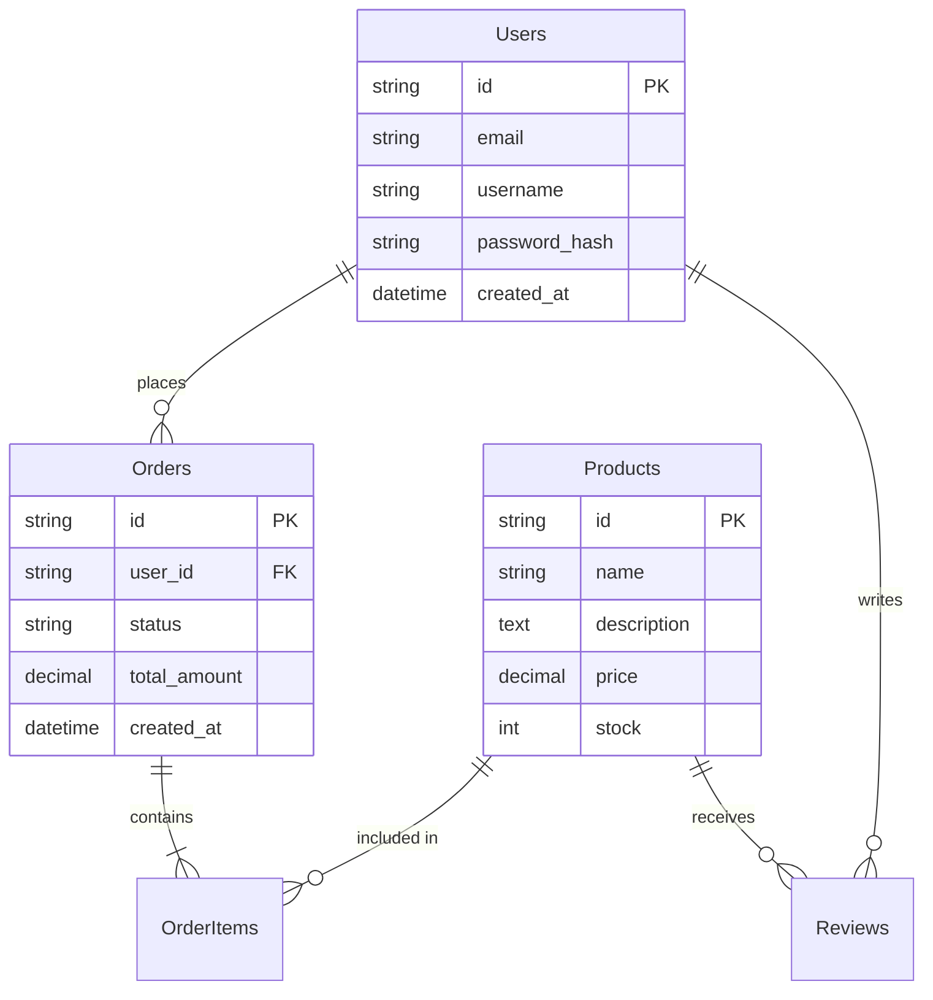
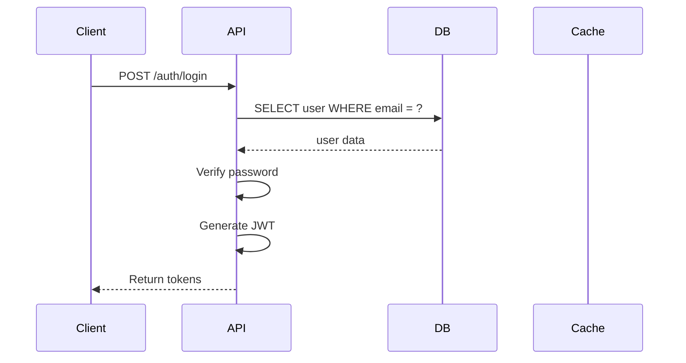

# 技術仕様書：[システム/機能名]

> **テンプレート利用ガイド**
> エンジニア向けの詳細な技術仕様書です。実装前に設計を明確にし、チーム内でレビューしてください。
> multi-novelプロジェクトの技術仕様書構造を参考に、実践的なテンプレートとして設計しています。
> **利用職種**: Engineer (主), TechLead, EM

---

## 1. 概要 (Overview)

<!-- 技術的な概要を2-3段落で記述 -->
[この機能が何を実現するか、技術的な観点から説明]

### 設計方針
- **[方針1]**: [説明]
- **[方針2]**: [説明]
- **[方針3]**: [説明]

<!-- 例: -->
<!-- - **パフォーマンス優先**: キャッシュを積極活用 -->
<!-- - **スケーラビリティ**: ステートレス設計 -->
<!-- - **コスト最適化**: 無料枠・低コストサービスを活用 -->

---

## 2. システムアーキテクチャ (Architecture)

### アーキテクチャ構成図

```mermaid
graph TD
    User[ユーザー (Web/Mobile)] --> CDN[CDN]
    CDN --> Frontend[Frontend]
    CDN --> API[Backend API]

    subgraph Backend Services
        API --> DB[(Database)]
        API --> Cache[(Cache)]
        API --> Storage[(Object Storage)]
    end
```

<!-- または ASCII図でも可 -->
```
┌─ Client ─────────────────────────┐
│  Web / Mobile / Desktop          │
│  ├─ UI Framework                 │
│  ├─ State Management             │
│  └─ API Client                   │
└──────────────────────────────────┘
              ↕ (HTTP/WebSocket)
┌─ Server ─────────────────────────┐
│  Backend Application             │
│  ├─ API Layer                    │
│  ├─ Business Logic               │
│  ├─ Data Access Layer            │
│  └─ Database                     │
└──────────────────────────────────┘
```

### 技術スタック

| コンポーネント | 技術 | バージョン | 採用理由 |
|---------------|------|-----------|----------|
| フロントエンド | [React / Vue / Angular / Astro] | XX.x | [理由] |
| バックエンド | [Node.js / Python / Go] | XX.x | [理由] |
| データベース | [PostgreSQL / MySQL / MongoDB / SQLite] | XX.x | [理由] |
| キャッシュ | [Redis / Memcached] | XX.x | [理由] |
| インフラ | [AWS / GCP / Azure / Cloudflare] | - | [理由] |
| その他 | [追加の技術] | XX.x | [理由] |

### 設計原則

#### 1. スケーラビリティ
- [原則1]: [説明]
- [原則2]: [説明]

#### 2. 保守性
- [原則1]: [説明]
- [原則2]: [説明]

#### 3. セキュリティ
- [原則1]: [説明]
- [原則2]: [説明]

#### 4. パフォーマンス
- [原則1]: [説明]
- [原則2]: [説明]

---

## 3. フロントエンド設計 (Frontend)

### UIフレームワーク
- **Framework**: [React / Vue / Angular / Astro]
- **Language**: [TypeScript / JavaScript]
- **Styling**: [Tailwind CSS / CSS Modules / styled-components]
- **UI Library**: [shadcn/ui / MUI / Ant Design]
- **State Management**: [Redux / Zustand / nanostores / Pinia]

### ディレクトリ構成
```
src/
├── components/       # UI components
│   ├── ui/          # Base components
│   └── features/    # Feature-specific components
├── pages/           # Page components
├── hooks/           # Custom hooks
├── lib/             # Utilities
├── stores/          # State management
└── types/           # TypeScript types
```

### コンポーネント設計
<!-- 主要コンポーネントの設計 -->

#### [コンポーネント名]
- **責務**: [説明]
- **Props**: [説明]
- **State**: [説明]

---

## 4. バックエンド設計 (Backend)

### アーキテクチャパターン
- **パターン**: [レイヤードアーキテクチャ / クリーンアーキテクチャ / DDD]
- **説明**: [理由と実装方針]

### レイヤー構成
```
backend/
├── api/             # API layer (Controllers/Handlers)
├── service/         # Business logic layer
├── repository/      # Data access layer
├── model/           # Domain models
├── middleware/      # Middleware (Auth, Logging, etc.)
└── util/            # Utilities
```

### 主要モジュール
<!-- 主要なビジネスロジックモジュール -->

#### [モジュール名]
- **責務**: [説明]
- **依存関係**: [説明]

---

## 5. データモデル (Data Model)

### ER図 (Mermaid)



### テーブル定義

#### users テーブル
| カラム名 | 型 | 制約 | 説明 |
|----------|----|------|------|
| id | UUID / TEXT | PRIMARY KEY | ユーザーID |
| email | VARCHAR(255) / TEXT | UNIQUE, NOT NULL | メールアドレス |
| username | VARCHAR(100) / TEXT | UNIQUE, NOT NULL | ユーザー名 |
| password_hash | VARCHAR(255) / TEXT | NOT NULL | ハッシュ化されたパスワード |
| display_name | VARCHAR(100) / TEXT | NOT NULL | 表示名 |
| role | VARCHAR(50) / TEXT | DEFAULT 'user' | ロール (user, admin) |
| created_at | TIMESTAMP / INTEGER | NOT NULL | 作成日時 |
| updated_at | TIMESTAMP / INTEGER | NOT NULL | 更新日時 |

#### [その他のテーブルも同様に記載]

### インデックス設計

```sql
-- Users
CREATE INDEX idx_users_email ON users(email);
CREATE INDEX idx_users_username ON users(username);
CREATE INDEX idx_users_created_at ON users(created_at DESC);

-- Orders
CREATE INDEX idx_orders_user_id ON orders(user_id);
CREATE INDEX idx_orders_status ON orders(status);
CREATE INDEX idx_orders_created_at ON orders(created_at DESC);
```

### マイグレーション戦略
- **ツール**: [Drizzle / Prisma / TypeORM / Alembic]
- **戦略**: [説明]

---

## 6. API設計 (API)

### エンドポイント一覧

| Method | Path | Description | Auth | Rate Limit |
|--------|------|-------------|------|------------|
| POST | /api/v1/auth/register | 新規登録 | No | 5 req/min |
| POST | /api/v1/auth/login | ログイン | No | 10 req/min |
| GET | /api/v1/users/me | 自分の情報取得 | Yes | 100 req/min |
| PUT | /api/v1/users/me | 自分の情報更新 | Yes | 20 req/min |
| GET | /api/v1/products | 商品一覧取得 | No | 1000 req/min |
| GET | /api/v1/products/:id | 商品詳細取得 | No | 1000 req/min |

### API詳細仕様

#### POST /api/v1/auth/login

**Request:**
```json
{
  "email": "user@example.com",
  "password": "password123"
}
```

**Response (成功 200):**
```json
{
  "access_token": "eyJhbGciOiJIUzI1NiIs...",
  "refresh_token": "eyJhbGciOiJIUzI1NiIs...",
  "expires_in": 3600,
  "user": {
    "id": "usr_123",
    "email": "user@example.com",
    "username": "johndoe",
    "display_name": "John Doe"
  }
}
```

**Response (エラー 401):**
```json
{
  "error": {
    "code": "invalid_credentials",
    "message": "メールアドレスまたはパスワードが正しくありません"
  }
}
```

#### [その他のエンドポイントも同様に記載]

参照: [51.02_API_Spec.md](51.02_API_Spec.md)

---

## 7. 認証・認可 (Authentication & Authorization)

### 認証方式
- **方式**: [JWT / Session / OAuth 2.0]
- **説明**: [実装詳細]

### トークン管理
- **Access Token**: 有効期限 [1時間 / 15分]
- **Refresh Token**: 有効期限 [7日 / 30日]
- **保存場所**: [Cookie / LocalStorage / SessionStorage]

### 権限設計
| ロール | 権限 |
|--------|------|
| user | 基本機能の利用 |
| admin | 全機能 + 管理画面 |
| [カスタムロール] | [説明] |

参照: [51.03_Auth_Spec.md](51.03_Auth_Spec.md)

---

## 8. シーケンス図

### [主要フロー名]



<!-- または ASCII図でも可 -->
```
Client -> Server: POST /auth/login (email, password)
Server -> DB: SELECT user WHERE email = ?
DB -> Server: user data
Server -> Server: Verify password (Argon2id)
Server -> Server: Generate JWT (access + refresh token)
Server -> Client: Return tokens
```

---

## 9. セキュリティ (Security)

### OWASP Top 10 対策

| 脆弱性 | 対策 |
|--------|------|
| A01: Broken Access Control | [対策内容] |
| A02: Cryptographic Failures | [対策内容] |
| A03: Injection | [対策内容] |
| A04: Insecure Design | [対策内容] |
| A05: Security Misconfiguration | [対策内容] |
| A06: Vulnerable Components | [対策内容] |
| A07: Authentication Failures | [対策内容] |
| A08: Software and Data Integrity Failures | [対策内容] |
| A09: Security Logging Failures | [対策内容] |
| A10: Server-Side Request Forgery | [対策内容] |

### データ保護
- **パスワード**: [Argon2id / bcrypt] でハッシュ化
- **通信**: HTTPS (TLS 1.2+) 必須
- **JWT署名**: [RS256 / HS256]
- **CORS**: 許可するオリジンを限定

### Rate Limiting
- **ログインAPI**: 10 req/min
- **一般API**: 100 req/min
- **実装**: [Redis / Cloudflare Workers]

---

## 10. パフォーマンス要件 (Performance)

### 目標値

| 指標 | 目標値 | 測定方法 |
|------|--------|----------|
| API応答時間 (95パーセンタイル) | < 200ms | CloudWatch / Datadog |
| ページロード時間 | < 3秒 | Lighthouse |
| データベースクエリ時間 | < 100ms | DB監視ツール |
| TTI (Time to Interactive) | < 5秒 | Lighthouse |

### キャッシュ戦略

| 対象 | キャッシュ先 | TTL | 無効化タイミング |
|------|-------------|-----|------------------|
| [Static Assets] | [CDN] | [1年] | [デプロイ時] |
| [API Response] | [Redis] | [5分] | [データ更新時] |
| [Database Query] | [Application Cache] | [1分] | [データ変更時] |

---

## 11. インフラ構成 (Infrastructure)

### クラウド環境
- **プロバイダー**: [AWS / GCP / Azure / Cloudflare]
- **リージョン**: [ap-northeast-1 / us-west-2]

### サービス構成

| サービス | 用途 | 構成 |
|---------|------|------|
| [EC2 / ECS / Cloud Run] | アプリケーション実行 | [構成詳細] |
| [RDS / Cloud SQL] | データベース | [構成詳細] |
| [S3 / R2] | オブジェクトストレージ | [構成詳細] |
| [CloudFront / Cloudflare] | CDN | [構成詳細] |

### ネットワーク構成
```
Internet
    ↓
[CDN / Load Balancer]
    ↓
[Application Servers (Auto Scaling)]
    ↓
[Private Subnet]
    ├─ Database
    ├─ Cache
    └─ Queue
```

---

## 12. デプロイ戦略 (Deployment)

### 環境
- **Dev**: 開発環境 (自動デプロイ)
- **Staging**: ステージング環境 (手動承認後デプロイ)
- **Production**: 本番環境 (手動承認後デプロイ)

### デプロイフロー
```
1. Feature Branch → Dev 環境 (自動)
2. Dev → Staging (PR承認後、自動)
3. Staging → Production (手動承認後、Blue-Green)
```

### ロールバック戦略
- **方法**: [Blue-Green / Rolling / Recreate]
- **手順**: [説明]

---

## 13. モニタリング・ロギング (Monitoring & Logging)

### メトリクス監視
- **ツール**: [Datadog / CloudWatch / Prometheus]
- **監視項目**:
  - CPU使用率
  - メモリ使用率
  - API応答時間
  - エラーレート

### ログ管理
- **ツール**: [CloudWatch Logs / Datadog / ELK Stack]
- **ログレベル**: DEBUG / INFO / WARN / ERROR / FATAL
- **保存期間**: [30日 / 90日]

### アラート設定

| アラート | 条件 | 通知先 |
|---------|------|--------|
| API Error Rate | 5%以上 | Slack #alerts |
| Response Time | P95 > 1秒 | Slack #alerts |
| Database Connection | 失敗 | PagerDuty |

---

## 14. エラーハンドリング (Error Handling)

### エラーコード定義

| エラーコード | HTTPステータス | 説明 | 対応 |
|-------------|---------------|------|------|
| invalid_request | 400 | リクエストパラメータ不正 | パラメータを修正 |
| unauthorized | 401 | 認証失敗 | 再ログイン |
| forbidden | 403 | 権限不足 | 権限を確認 |
| not_found | 404 | リソースなし | URLを確認 |
| conflict | 409 | データ競合 | リトライ |
| internal_error | 500 | サーバー内部エラー | サポートに連絡 |
| service_unavailable | 503 | サービス利用不可 | 時間をおいてリトライ |

### エラーレスポンス形式
```json
{
  "error": {
    "code": "invalid_request",
    "message": "メールアドレスの形式が不正です",
    "details": {
      "field": "email",
      "reason": "invalid_format"
    }
  }
}
```

---

## 15. テスト戦略 (Testing Strategy)

### テストレベル

| テストレベル | カバレッジ目標 | ツール | 実行タイミング |
|-------------|---------------|--------|---------------|
| Unit Test | 80%以上 | [Jest / Vitest / pytest] | 毎コミット |
| Integration Test | 主要API全て | [Supertest / pytest] | 毎PR |
| E2E Test | クリティカルパス | [Playwright / Cypress] | 毎デプロイ |
| Performance Test | 主要API | [k6 / JMeter] | 週次 |

### テストケース例

#### [機能名] のテストケース
- [ ] 正常系: [シナリオ]
- [ ] 異常系: [シナリオ]
- [ ] エッジケース: [シナリオ]

---

## 16. 非機能要件 (Non-Functional Requirements)

### スケーラビリティ
| 指標 | 目標値 |
|------|--------|
| 同時接続ユーザー数 | 10,000+ |
| リクエスト処理数 | 1,000 req/sec |

### 可用性
| 指標 | 目標値 |
|------|--------|
| Uptime | 99.9% |
| RTO (復旧時間目標) | < 1時間 |
| RPO (目標復旧時点) | < 1時間 |

---

## 17. 依存関係とリスク (Dependencies & Risks)

### 外部依存

| 依存サービス | 用途 | リスク | 対策 |
|-------------|------|--------|------|
| [外部API] | [用途] | [APIダウン] | [フォールバック機構] |
| [決済サービス] | [決済処理] | [障害] | [リトライ、手動対応] |

### 技術的リスク

| リスク | 発生確率 | 影響度 | 対策 |
|--------|---------|--------|------|
| [リスク1] | High/Medium/Low | High/Medium/Low | [対策] |
| [リスク2] | High/Medium/Low | High/Medium/Low | [対策] |

---

## 18. マイグレーション計画 (Migration)

### データベースマイグレーション

```sql
-- Migration: 001_create_users_table
CREATE TABLE users (
  id UUID PRIMARY KEY DEFAULT gen_random_uuid(),
  email VARCHAR(255) UNIQUE NOT NULL,
  username VARCHAR(100) UNIQUE NOT NULL,
  password_hash VARCHAR(255) NOT NULL,
  created_at TIMESTAMP NOT NULL DEFAULT CURRENT_TIMESTAMP,
  updated_at TIMESTAMP NOT NULL DEFAULT CURRENT_TIMESTAMP
);

-- Create indexes
CREATE INDEX idx_users_email ON users(email);
CREATE INDEX idx_users_username ON users(username);
```

### 既存システムからの移行
<!-- 既存システムがある場合の移行計画 -->
- **移行方式**: [一括移行 / 段階的移行]
- **ダウンタイム**: [時間]
- **ロールバック計画**: [説明]

---

## 19. コスト最適化 (Cost Optimization)

<!-- オプション: コスト意識が重要な場合 -->

### コスト構造

| 項目 | 月額コスト | 最適化施策 |
|------|-----------|----------|
| [インフラ] | [$XX] | [施策] |
| [外部API] | [$XX] | [施策] |

### 最適化戦略
- [戦略1]: [説明]
- [戦略2]: [説明]

---

## 20. オープンクエスチョン (Open Questions)

- [ ] **Q1**: [質問内容] (決定者: Name, 期限: MM/DD)
- [ ] **Q2**: [質問内容] (決定者: Name, 期限: MM/DD)

---

## 21. 承認 (Approval)

| 役割 | 名前 | 承認日 | サイン |
|------|------|--------|--------|
| TechLead | Name | YYYY/MM/DD | ✅ |
| EM | Name | YYYY/MM/DD | ✅ |
| Security | Name | YYYY/MM/DD | ✅ |

---

## 22. AIレビューチェックリスト

Tech Spec作成後、AIに以下を確認依頼することを推奨します：

### 品質チェック項目

- [ ] **アーキテクチャ**: 図が明確で、スケーラビリティが考慮されているか
- [ ] **データモデル**: ER図が正規化され、インデックスが適切か
- [ ] **API設計**: RESTful原則に従っているか、エラーレスポンスが明確か
- [ ] **セキュリティ**: OWASP Top 10の脆弱性が考慮されているか
- [ ] **パフォーマンス**: レスポンスタイム、スループットが数値で定義されているか
- [ ] **エラーハンドリング**: 例外ケースが網羅されているか
- [ ] **テスト戦略**: Unit/Integration/E2Eのカバレッジ目標が明確か
- [ ] **運用性**: モニタリング、ログ、アラート、ロールバック手順が定義されているか
- [ ] **コスト**: インフラコストが見積もられているか（重要な場合）

### AIプロンプト例

```
以下のTech Specを品質レビューしてください：

[Tech Specの内容を貼り付け]

チェック項目：
- アーキテクチャ図が明確か（Mermaid図含む）
- データモデルがER図で表現されているか
- APIエンドポイントが全て定義されているか
- セキュリティ脆弱性が考慮されているか（OWASP Top 10）
- パフォーマンス要件が数値で定義されているか
- エラーハンドリングが網羅されているか
- テスト戦略が明確か（カバレッジ目標）
- モニタリング/アラートが定義されているか
- インフラ構成が明確か

不足している項目と具体的な追加提案を出してください。

参考: /home/salaim/work/product-docs/00_Meta/00.03_AI_Prompts.md
```

### レビュー結果の記録

AIレビューで指摘された項目:
- [指摘事項を記録]
- [対応状況を記録]

---

## 関連ドキュメント

- [PRD](../../30_Definition_Requirements/31.01_PRD_<Function_Name>.md) - 機能要件
- [Design Handoff](../../40_Design_UX/41.01_Design_Handoff_<Function_Name>.md) - UI/UX仕様
- [API Spec](51.02_API_Spec.md) - API詳細仕様
- [ADR](52.01_ADR_<Title>.md) - アーキテクチャ決定記録
