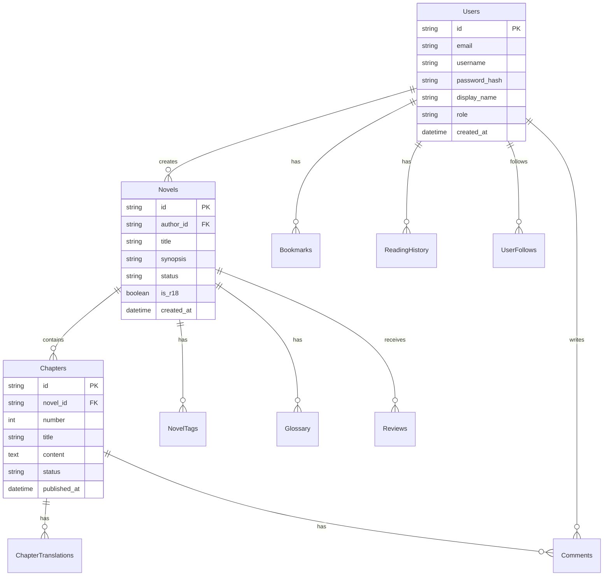

# データベース設計書

> **テンプレート利用ガイド**
> データベーススキーマとER図を管理します。
> **利用職種**: Backend Engineer, DBA

---

## 1. データベース構成
- **Database**: Cloudflare D1 (SQLite)
- **KeyValue Store**: Cloudflare KV (Session, Cache)
- **Object Storage**: Cloudflare R2 (Images)

---

## 2. ER図 (Mermaid)



---

## 3. テーブル定義

### Users
| Column | Type | Constraint | Note |
|---|---|---|---|
| id | TEXT | PK | `usr_*` |
| email | TEXT | UNIQUE, NOT NULL | |
| username | TEXT | UNIQUE, NOT NULL | |
| role | TEXT | DEFAULT 'user' | `user`, `writer`, `admin` |

### Novels
| Column | Type | Constraint | Note |
|---|---|---|---|
| id | TEXT | PK | `nvl_*` |
| author_id | TEXT | FK, NOT NULL | |
| title | TEXT | NOT NULL | |
| original_language | TEXT | DEFAULT 'ja' | |

### Chapters
| Column | Type | Constraint | Note |
|---|---|---|---|
| id | TEXT | PK | `chp_*` |
| novel_id | TEXT | FK, NOT NULL | |
| content | TEXT | NOT NULL | HTML/Markdown |

### ChapterTranslations
| Column | Type | Constraint | Note |
|---|---|---|---|
| id | TEXT | PK | `tr_*` |
| chapter_id | TEXT | FK, NOT NULL | |
| language | TEXT | NOT NULL | `en`, `ko`, `zh-tw` |
| content | TEXT | NOT NULL | 翻訳本文 |

### Glossary
| Column | Type | Constraint | Note |
|---|---|---|---|
| id | TEXT | PK | `gl_*` |
| novel_id | TEXT | FK | |
| term | TEXT | NOT NULL | 原語 |
| translation | TEXT | NOT NULL | 翻訳語 |

---

## 4. インデックス設計
```sql
CREATE INDEX idx_novels_author ON Novels(author_id);
CREATE INDEX idx_chapters_novel ON Chapters(novel_id, number);
CREATE INDEX idx_history_user ON ReadingHistory(user_id, last_read_at DESC);
```

---
## 関連ドキュメント
- [51.01_TechSpec_Backend.md](51.01_TechSpec_Backend.md)
