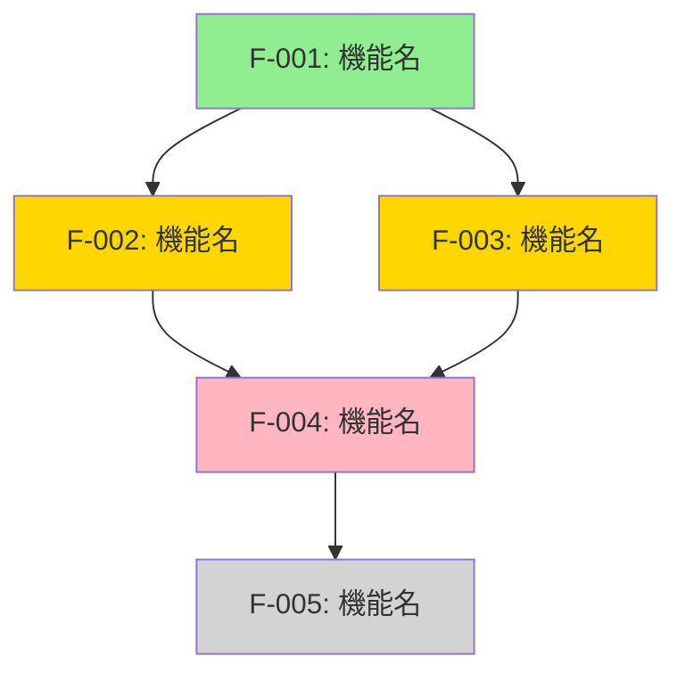

# 機能一覧

> [!NOTE]
> プロダクトの全機能を体系的に整理するドキュメントです。
> 機能の優先度、開発状況、関連ドキュメントをマトリクス形式で管理します。
> **利用職種**: PdM (主), エンジニア, QA, デザイナー

---

## エグゼクティブサマリー

<!-- 1-2段落で機能全体の方向性を説明 -->

[このプロダクトは〇〇の課題を解決するため、△△の機能群を提供する。MVP版では××機能を優先実装し、段階的に□□機能を拡張していく。]

## 機能分類

### カテゴリー一覧

```
└── Category 1: [カテゴリー名]
    ├── Feature 1.1: [機能名]
    ├── Feature 1.2: [機能名]
    └── Feature 1.3: [機能名]
└── Category 2: [カテゴリー名]
    ├── Feature 2.1: [機能名]
    └── Feature 2.2: [機能名]
└── Category 3: [カテゴリー名]
    └── Feature 3.1: [機能名]
```

## 機能マトリクス

### 凡例

- **優先度**: P0 (必須) / P1 (重要) / P2 (あると良い) / P3 (将来)
- **ステータス**: 未着手 / 設計中 / 開発中 / レビュー中 / 完了 / 保留
- **複雑度**: 低 / 中 / 高

### 全機能一覧

| ID    | カテゴリー | 機能名   | 優先度 | ステータス | 複雑度 | 担当   | リリース予定 | 関連ドキュメント               |
| ----- | ---------- | -------- | ------ | ---------- | ------ | ------ | ------------ | ------------------------------ |
| F-001 | [Category] | [機能名] | P0     | 開発中     | 中     | [Name] | YYYY/MM/DD   | [PRD](link), [Tech Spec](link) |
| F-002 | [Category] | [機能名] | P1     | 未着手     | 高     | [Name] | YYYY/MM/DD   | [PRD](link)                    |
| F-003 | [Category] | [機能名] | P2     | 保留       | 低     | -      | TBD          | -                              |

<!-- 例: -->
<!-- | F-001 | 認証 | メールアドレス登録 | P0 | 完了 | 中 | 山田 | 2024/03/15 | [PRD](31.01_PRD_Authentication.md) | -->
<!-- | F-002 | 認証 | SSO (Google) | P1 | 開発中 | 高 | 佐藤 | 2024/04/01 | [Tech Spec](../50_Engineering_Tech/51.01_TechSpec_SSO.md) | -->
<!-- | F-003 | 通知 | プッシュ通知 | P2 | 未着手 | 中 | - | 2024/05/01 | [PRD](31.01_PRD_Notification.md) | -->

## カテゴリー別詳細

### Category 1: [カテゴリー名]

#### F-001: [機能名]

- **概要**: [1-2行で機能を説明]
- **ユーザーストーリー**: [ユーザー]として、[目的]のために、[機能]が欲しい
- **優先度**: P0
- **ステータス**: 開発中
- **複雑度**: 中
- **前提条件**: [この機能を実装する前に必要な機能や条件]
- **関連機能**: [F-002], [F-005]
- **関連ドキュメント**:
  - 個別機能のPRD、Tech Spec、Design Handoffへのリンクは、各機能の実装時に追加してください
  - テンプレート: [docs/_templates/](../../_templates/)

#### F-002: [機能名]

- **概要**: [説明]
- **ユーザーストーリー**: [説明]
- **優先度**: P1
- **ステータス**: 未着手
- **複雑度**: 高
- **前提条件**: [F-001]が完了していること
- **関連機能**: [F-001]
- **関連ドキュメント**: [リンク]

### Category 2: [カテゴリー名]

#### F-003: [機能名]

[同様の形式で記載]

## リリース計画

### MVP (Minimum Viable Product)

**リリース予定**: YYYY/MM/DD

| 機能ID | 機能名   | ステータス | 担当   |
| ------ | -------- | ---------- | ------ |
| F-001  | [機能名] | 開発中     | [Name] |
| F-002  | [機能名] | 未着手     | [Name] |

### Phase 1

**リリース予定**: YYYY/MM/DD

| 機能ID | 機能名   | ステータス | 担当   |
| ------ | -------- | ---------- | ------ |
| F-003  | [機能名] | 未着手     | [Name] |
| F-004  | [機能名] | 未着手     | [Name] |

### Phase 2

**リリース予定**: YYYY/MM/DD

| 機能ID | 機能名   | ステータス | 担当   |
| ------ | -------- | ---------- | ------ |
| F-005  | [機能名] | 未着手     | [Name] |

## 機能間の依存関係



**凡例**:

- 🟢 緑: 完了
- 🟡 黄: 開発中
- 🔴 ピンク: 未着手
- ⚪ グレー: 保留

## 優先度別サマリー

| 優先度          | 機能数 | 完了 | 開発中 | 未着手 | 保留 |
| --------------- | ------ | ---- | ------ | ------ | ---- |
| P0 (必須)       | [数]   | [数] | [数]   | [数]   | [数] |
| P1 (重要)       | [数]   | [数] | [数]   | [数]   | [数] |
| P2 (あると良い) | [数]   | [数] | [数]   | [数]   | [数] |
| P3 (将来)       | [数]   | [数] | [数]   | [数]   | [数] |
| **合計**        | [数]   | [数] | [数]   | [数]   | [数] |

### 進捗率

- **全体**: [XX]% (完了 / 全体)
- **MVP**: [XX]% (MVP完了 / MVP全体)
- **P0機能**: [XX]% (P0完了 / P0全体)

## 技術的制約・課題

| 機能ID | 機能名   | 制約・課題 | 影響度          | 対策       | ステータス      |
| ------ | -------- | ---------- | --------------- | ---------- | --------------- |
| F-002  | [機能名] | [制約内容] | High/Medium/Low | [対策内容] | 対応中 / 解決済 |
| F-004  | [機能名] | [課題内容] | High/Medium/Low | [対策内容] | 未対応          |

## スコープ外機能

以下の機能は現在のスコープ外です（将来検討）：

| 機能名   | 理由           | 再検討時期 |
| -------- | -------------- | ---------- |
| [機能名] | [理由]         | YYYY/QX    |
| [機能名] | [リソース不足] | YYYY/QX    |

## 機能変更履歴

| 日付       | 機能ID | 変更内容            | 理由                   | 変更者 |
| ---------- | ------ | ------------------- | ---------------------- | ------ |
| YYYY/MM/DD | F-003  | 優先度をP1→P2に変更 | リソース不足           | [Name] |
| YYYY/MM/DD | F-007  | 新規追加            | ユーザーフィードバック | [Name] |
| YYYY/MM/DD | F-010  | スコープ外に変更    | 技術的実現困難         | [Name] |

## 承認

| 役割      | 名前 | 承認日     | サイン |
| --------- | ---- | ---------- | ------ |
| PdM       | Name | YYYY/MM/DD | ✅     |
| Tech Lead | Name | YYYY/MM/DD | ✅     |
| Designer  | Name | YYYY/MM/DD | ✅     |

## AIレビューチェックリスト

機能一覧作成後、AIに以下を確認依頼することを推奨します：

### 品質チェック項目

- [ ] **網羅性**: すべての機能が分類され、漏れがないか
- [ ] **優先度**: MoSCoW法に基づき適切に優先順位付けされているか
- [ ] **依存関係**: 機能間の依存関係が明確か
- [ ] **整合性**: PRD、Roadmapと整合しているか
- [ ] **実現可能性**: 技術的制約を考慮した計画か
- [ ] **追跡可能性**: 各機能に関連ドキュメントへのリンクがあるか

### AIプロンプト例

```
以下の機能一覧を品質レビューしてください：

[このドキュメントの内容を貼り付け]

チェック項目：
- すべての機能が適切にカテゴリー分類されているか
- 優先度付けが合理的か（P0は本当に必須か、P2は本当にオプショナルか）
- 機能間の依存関係に矛盾がないか
- リリース計画が実現可能か（リソース、期間）
- スコープ外機能の判断が妥当か

不足している機能や、優先度の見直しが必要な機能を指摘してください。

参考: /home/salaim/work/product-docs/_meta/00.03_AI_Prompts.md
```

### レビュー結果の記録

AIレビューで指摘された項目:

- [指摘事項を記録]
- [対応状況を記録]

---

## 関連ドキュメント

- [12.01_Roadmap.md](../10_Strategy_Planning/12.01_Roadmap.md) - プロダクトロードマップ
- [31.00_PRD_Index.md](31.00_PRD_Index.md) - PRD一覧
- [41.01_Screen_Transition_Diagram.md](../40_Design_UX/41.01_Screen_Transition_Diagram.md) - 画面遷移図
- [51.02_API_Spec.md](../50_Engineering_Tech/51.02_API_Spec.md) - API仕様

> [!NOTE]
> 個別機能のPRD、Tech Specへのリンクは、各機能の実装時に追加してください。
> テンプレート: [docs/_templates/](../../_templates/)
