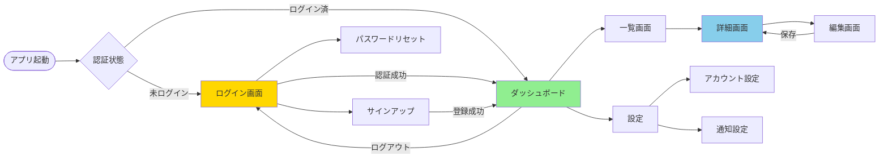
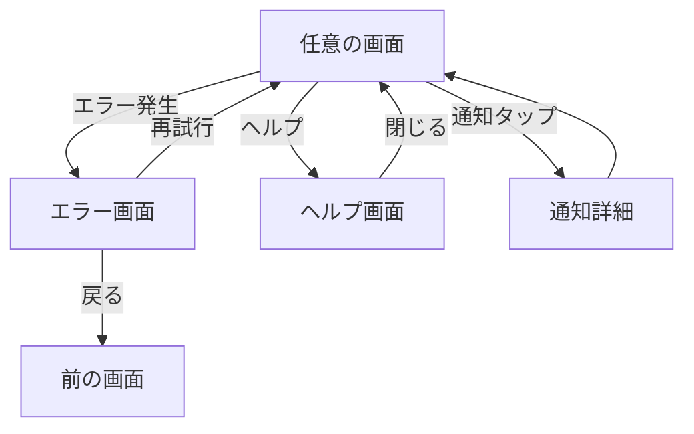
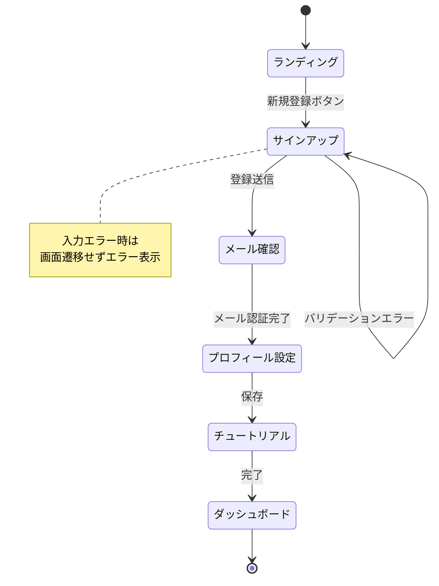
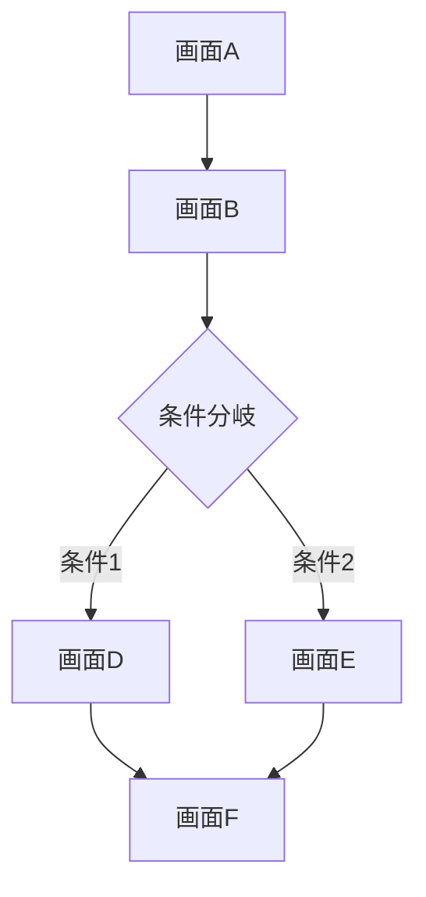
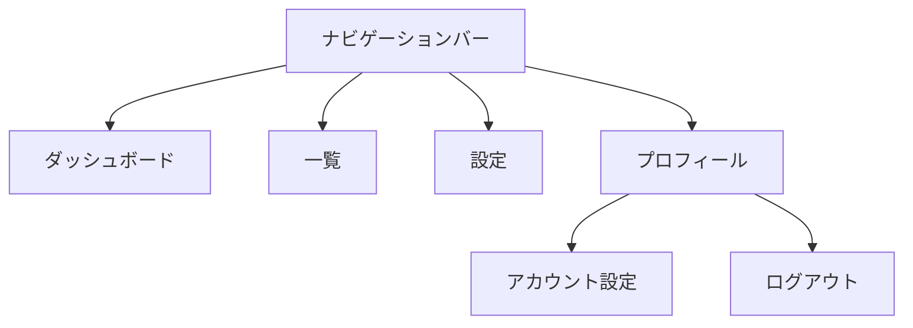
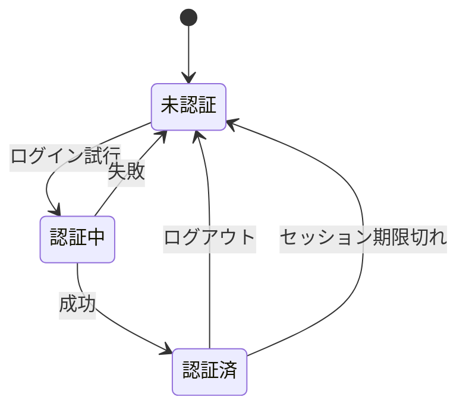
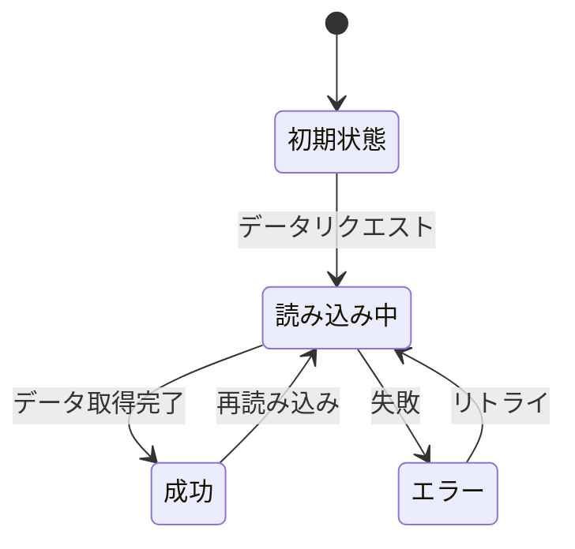
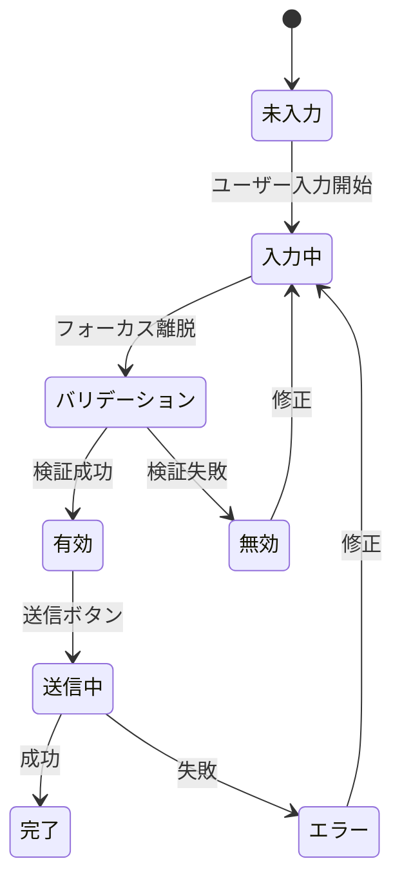
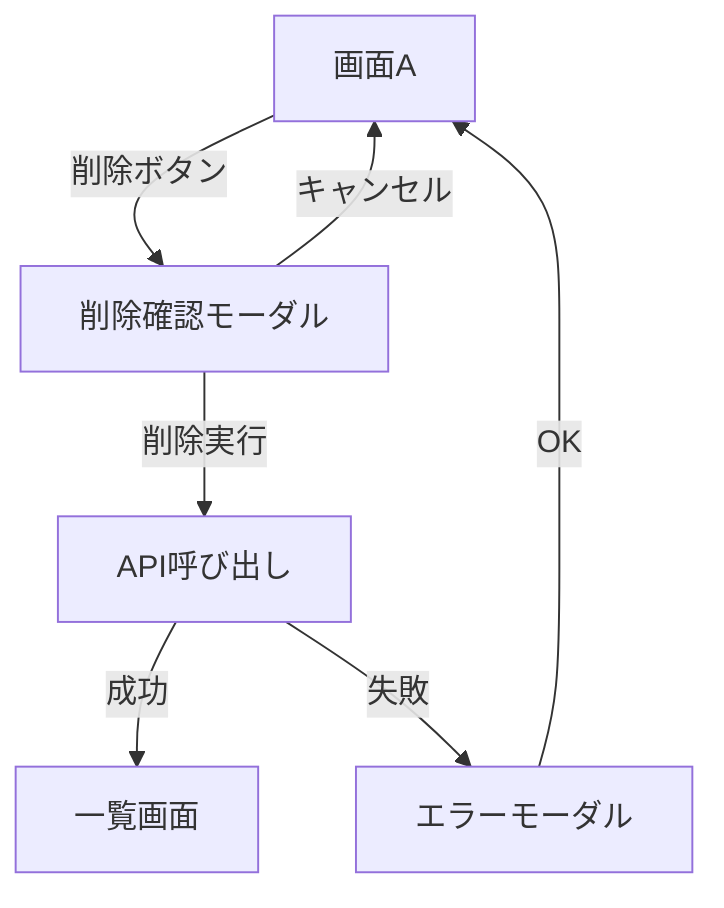
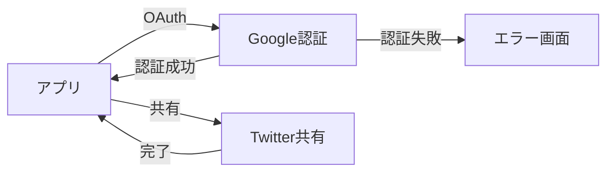

> **テンプレート利用ガイド**
> プロダクトの画面構成と画面間の遷移を可視化するドキュメントです。
> ユーザーフロー、ナビゲーション構造、状態遷移を図式化し、開発・デザイン・QAの共通理解を促進します。
> **利用職種**: デザイナー (主), PdM, エンジニア, QA

---

## 1. エグゼクティブサマリー
<!-- 1-2段落で画面構成の全体像を説明 -->

[このプロダクトは〇〇個の画面から構成され、△△のユーザーフローを実現する。主要な導線は××であり、□□の状態遷移パターンを持つ。]

---

## 2. 画面構成の概要 (Screen Structure Overview)

### 画面カテゴリー
```
└── 認証系 (Authentication)
    ├── ログイン画面
    ├── サインアップ画面
    └── パスワードリセット画面
└── メイン機能 (Main Features)
    ├── ダッシュボード
    ├── 一覧画面
    ├── 詳細画面
    └── 編集画面
└── 設定系 (Settings)
    ├── アカウント設定
    └── 通知設定
└── その他 (Others)
    ├── エラー画面
    └── ヘルプ画面
```

### 画面数サマリー
| カテゴリー | 画面数 | 実装ステータス |
| --- | --- | --- |
| 認証系 | [数] | [完了 / 開発中 / 未着手] |
| メイン機能 | [数] | [完了 / 開発中 / 未着手] |
| 設定系 | [数] | [完了 / 開発中 / 未着手] |
| その他 | [数] | [完了 / 開発中 / 未着手] |
| **合計** | [数] | - |

---

## 3. 全体画面遷移図 (Overall Screen Transition Diagram)

### メイン導線


### サブ導線・エラーハンドリング


---

## 4. ユーザーフロー別詳細 (User Flow Details)

### Flow 1: 新規ユーザー登録フロー

#### フロー概要
新規ユーザーがアカウントを作成し、初回設定を完了するまでの流れ

#### 画面遷移図


#### 画面詳細
| 画面ID | 画面名 | 主要アクション | 遷移先 | 状態変化 |
| --- | --- | --- | --- | --- |
| S-001 | ランディング | 新規登録ボタン | S-002 | - |
| S-002 | サインアップ | 登録送信 | S-003 | user.status = "pending" |
| S-003 | メール確認 | メール内リンククリック | S-004 | user.verified = true |
| S-004 | プロフィール設定 | 保存ボタン | S-005 | user.profile = {data} |
| S-005 | チュートリアル | 完了ボタン | S-006 | user.onboarded = true |
| S-006 | ダッシュボード | - | - | - |

#### エラーケース
| エラー条件 | 画面 | エラー表示 | 遷移先 |
| --- | --- | --- | --- |
| メールアドレス重複 | S-002 | インラインエラー | S-002 (遷移なし) |
| メール送信失敗 | S-003 | トーストメッセージ | S-002 |
| セッションタイムアウト | S-004 | モーダル | S-001 |

---

### Flow 2: [フロー名]

#### フロー概要
[説明]

#### 画面遷移図


#### 画面詳細
[上記と同様の形式で記載]

---

## 5. 画面一覧 (Screen Inventory)

| 画面ID | カテゴリー | 画面名 | URL/Route | 認証要否 | 実装ステータス | デザイン | 関連ドキュメント |
| --- | --- | --- | --- | --- | --- | --- | --- |
| S-001 | 認証 | ログイン | /login | 不要 | 完了 | [Figma](link) | [PRD](link) |
| S-002 | 認証 | サインアップ | /signup | 不要 | 完了 | [Figma](link) | [PRD](link) |
| S-003 | メイン | ダッシュボード | /dashboard | 必要 | 開発中 | [Figma](link) | [PRD](link), [Design Handoff](../40_Design_UX/41.01_Design_Handoff_<Function_Name>.md) |
| S-004 | メイン | 一覧画面 | /items | 必要 | 未着手 | [Figma](link) | [PRD](link) |
| S-005 | メイン | 詳細画面 | /items/:id | 必要 | 未着手 | [Figma](link) | [PRD](link) |
| S-006 | 設定 | アカウント設定 | /settings/account | 必要 | 未着手 | [Figma](link) | [PRD](link) |

---

## 6. ナビゲーション構造 (Navigation Structure)

### グローバルナビゲーション


### パンくずリスト構造
```
ホーム > カテゴリー > サブカテゴリー > 詳細
```

例:
```
ダッシュボード > プロジェクト > [プロジェクト名] > タスク詳細
```

---

## 7. 状態遷移 (State Transitions)

### ユーザー認証状態


### データ読み込み状態


### フォーム入力状態


---

## 8. モーダル・ダイアログ遷移 (Modal/Dialog Transitions)

### モーダル一覧
| モーダルID | モーダル名 | トリガー | アクション | 遷移先 |
| --- | --- | --- | --- | --- |
| M-001 | 削除確認 | 削除ボタン | 削除実行 / キャンセル | 元の画面 / 一覧画面 |
| M-002 | エラー通知 | APIエラー | OK | 元の画面 |
| M-003 | フィルター設定 | フィルターボタン | 適用 / キャンセル | 元の画面 |

### モーダル遷移図


---

## 9. ディープリンク・外部遷移 (Deep Links & External Transitions)

### ディープリンク対応
| リンク形式 | 遷移先画面 | 認証要否 | 未認証時の挙動 |
| --- | --- | --- | --- |
| /items/:id | 詳細画面 | 必要 | ログイン画面 → 詳細画面 |
| /share/:token | 共有ページ | 不要 | 直接表示 |
| /invite/:code | 招待ページ | 条件付き | サインアップ → 詳細画面 |

### 外部サービス連携


---

## 10. レスポンシブ対応 (Responsive Design)

### デバイス別画面構成
| 画面ID | 画面名 | Desktop | Tablet | Mobile | 差異 |
| --- | --- | --- | --- | --- | --- |
| S-001 | ログイン | ✅ | ✅ | ✅ | 同一レイアウト |
| S-003 | ダッシュボード | ✅ | ✅ | ✅ | Mobile: ボトムナビゲーション |
| S-004 | 一覧画面 | ✅ | ✅ | ✅ | Mobile: カード表示 |
| S-006 | 設定 | ✅ | ✅ | ✅ | Mobile: フルスクリーン |

---

## 11. アクセシビリティ考慮 (Accessibility Considerations)

### キーボードナビゲーション
| 画面 | Tab順序 | ショートカット | フォーカス管理 |
| --- | --- | --- | --- |
| ログイン | メールアドレス → パスワード → ログインボタン | Enter: ログイン実行 | 初期フォーカス: メールアドレス |
| 一覧画面 | 検索 → フィルター → リスト項目 | `/`: 検索フォーカス | - |

### スクリーンリーダー対応
- すべての画面に適切な `<title>` と `aria-label`
- 画面遷移時に `aria-live` で通知
- モーダル表示時に `role="dialog"` と `aria-modal="true"`

---

## 12. パフォーマンス考慮 (Performance Considerations)

### ページ読み込み戦略
| 画面タイプ | 読み込み戦略 | プリフェッチ | キャッシュ |
| --- | --- | --- | --- |
| 静的ページ (ランディング) | SSG (Static Site Generation) | - | CDN |
| 動的ページ (ダッシュボード) | SSR (Server Side Rendering) | ナビゲーションリンク | ブラウザキャッシュ |
| リスト画面 | ISR (Incremental Static Regeneration) | 次ページ | SWR |
| 詳細画面 | CSR (Client Side Rendering) | 関連アイテム | - |

---

## 13. 実装メモ (Implementation Notes)

### ルーティング設定
```typescript
// 例: Next.js App Router
/app
  /login/page.tsx           → S-001
  /signup/page.tsx          → S-002
  /dashboard/page.tsx       → S-003
  /items/page.tsx           → S-004
  /items/[id]/page.tsx      → S-005
  /settings/account/page.tsx → S-006
```

### ナビゲーションガード
```typescript
// 認証が必要な画面
const protectedRoutes = [
  '/dashboard',
  '/items',
  '/items/*',
  '/settings/*'
]

// 未認証時のリダイレクト先
const redirectTo = '/login'
```

---

## 14. 変更履歴 (Change History)

| 日付 | 変更内容 | 理由 | 変更者 |
| --- | --- | --- | --- |
| YYYY/MM/DD | S-007 画面を削除 | ユーザビリティ改善 | [Name] |
| YYYY/MM/DD | S-003 → S-004 遷移を追加 | 新機能追加 | [Name] |
| YYYY/MM/DD | モーダルM-003 を追加 | フィルター機能実装 | [Name] |

---

## 15. 承認

| 役割 | 名前 | 承認日 | サイン |
| --- | --- | --- | --- |
| Designer | Name | YYYY/MM/DD | ✅ |
| PdM | Name | YYYY/MM/DD | ✅ |
| Tech Lead | Name | YYYY/MM/DD | ✅ |

---

## 16. AIレビューチェックリスト

画面遷移図作成後、AIに以下を確認依頼することを推奨します：

### 品質チェック項目

- [ ] **網羅性**: すべての画面と遷移が含まれているか
- [ ] **一貫性**: ユーザーフローに矛盾がないか
- [ ] **エラーハンドリング**: エラーケースの遷移が定義されているか
- [ ] **アクセシビリティ**: キーボードナビゲーションが考慮されているか
- [ ] **パフォーマンス**: 不要な画面遷移がないか
- [ ] **整合性**: PRD、デザインファイルと整合しているか

### AIプロンプト例

```
以下の画面遷移図を品質レビューしてください：

[このドキュメントの内容を貼り付け]

チェック項目：
- すべての主要なユーザーフローが網羅されているか
- 画面遷移に矛盾や行き止まりがないか
- エラーケース（ネットワークエラー、認証エラー等）の遷移が定義されているか
- 戻る動作が適切に定義されているか
- ディープリンクやモーダル遷移が考慮されているか

不足している画面や遷移、改善すべきユーザーフローを指摘してください。

参考: /home/salaim/work/product-docs/00_Meta/00.03_AI_Prompts.md
```

### レビュー結果の記録

AIレビューで指摘された項目:
- [指摘事項を記録]
- [対応状況を記録]

---

## 関連ドキュメント

- [31.01_PRD_<Function_Name>.md](../30_Definition_Requirements/31.01_PRD_<Function_Name>.md) - 機能要件定義
- [31.02_Feature_List.md](../30_Definition_Requirements/31.02_Feature_List.md) - 機能一覧
- [41.01_Design_Handoff_<Function_Name>.md](41.01_Design_Handoff_<Function_Name>.md) - デザイン仕様
- [51.01_TechSpec_<Function_Name>.md](../50_Engineering_Tech/51.01_TechSpec_<Function_Name>.md) - 技術仕様
